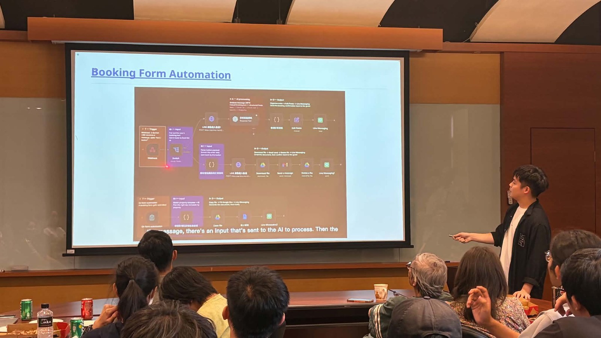
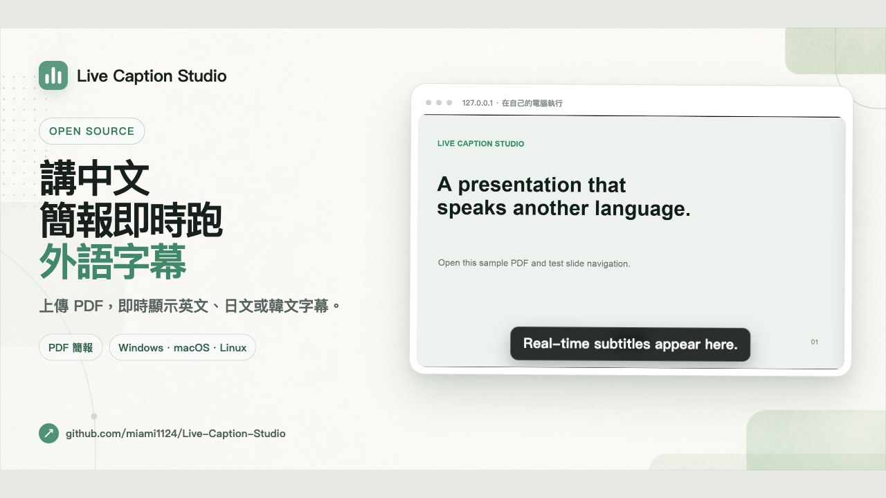
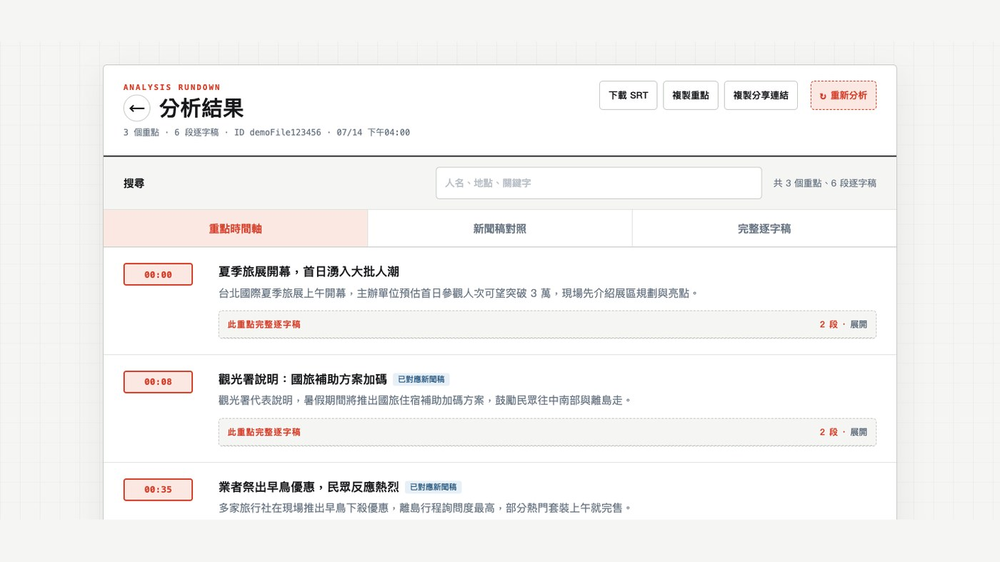
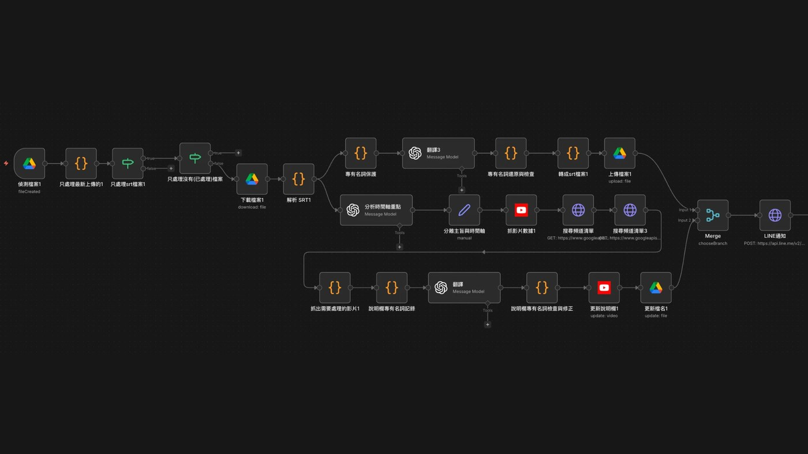
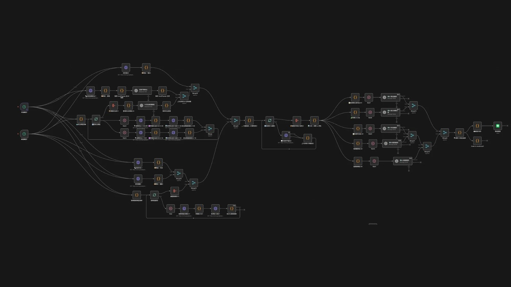
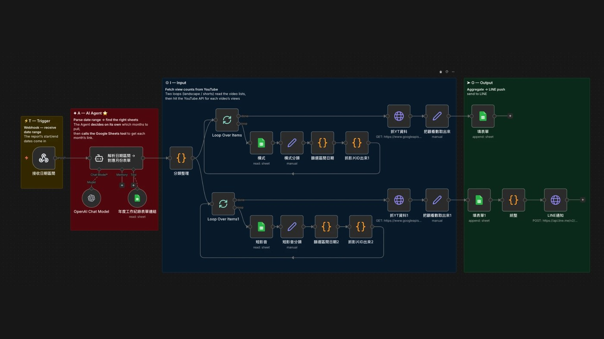
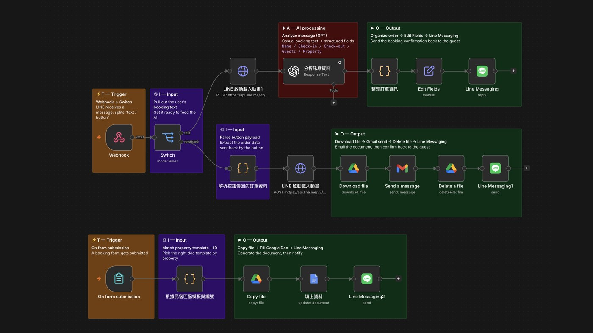

  

2026 年在中央研究院分享「非工程師的 AI 自動化」。畫面下方那行即時英文字幕，是我自己做的工具在跑。

# SAM

我不是工程師。我把工作現場的重複勞動，一個一個做成工具。

---

## 關於我

我的起點通常是一句抱怨——「這件事我已經做第三次了，能不能讓電腦自己做？」

把抱怨拆成流程，跟 AI 一起開發、測試，再拿回去給真正的使用者用。判斷做完沒有的標準只有一個——**有沒有人每天願意打開它。**

現在專門研究怎麼把 AI 帶進工作流程，讓不同部門少做一點重複的事。

---

## 做過的東西

<table>
<tr>
<td width="40%" valign="top">

**[Live-Caption-Studio](https://github.com/miami1124/Live-Caption-Studio)**

台上講中文，台下即時看到英／日／韓文字幕，直接疊在你的簡報上。在自己電腦上跑，自備 Gemini API key。

中研院那場演講就是用它完成的。

</td>
<td width="60%">

</td>
</tr>

<tr>
<td width="40%" valign="top">

**影片 AI 摘要工具**（內部工具，未開源）

要抓一支影片的重點，以前得整支看完。現在貼上連結，2-3 分鐘拿到逐字稿加時間軸重點，還能用自然語言搜尋整個影片庫。

Modal + Groq Whisper + Gemini，加一套 RAG 檢索。

</td>
<td width="60%">

</td>
</tr>

<tr>
<td width="40%" valign="top">

**[subtitle-automation-pipeline](https://github.com/miami1124/subtitle-automation-pipeline)**

字幕國際化流水線：偵測到新的 SRT → AI 翻譯（含專有名詞保護）→ 整理時間軸 → 自動上傳、更新說明欄。

</td>
<td width="60%">

</td>
</tr>

<tr>
<td width="40%" valign="top">

**[youtube-news-radar](https://github.com/miami1124/youtube-news-radar)**

每天自動掃台灣 YouTube 熱門影片，算熱度分數、AI 分類，推播出來當選題參考。

</td>
<td width="60%">

</td>
</tr>

<tr>
<td width="40%" valign="top">

**[youtube-analytics-reporter](https://github.com/miami1124/youtube-analytics-reporter)**

頻道雙週報自動化：抓數據、統整分類、填進表單、LINE 通知。原本要人工整理半天。

</td>
<td width="60%">

</td>
</tr>

<tr>
<td width="40%" valign="top">

**[guesthouse-booking-automation](https://github.com/miami1124/guesthouse-booking-automation)**

民宿預約單自動化（接案）。把客人的訂房訊息貼進 LINE Bot，AI 自動抓出姓名、日期、人數、房型，整理成預約單並回覆確認。省掉手動打字建檔那一段。

</td>
<td width="60%">

</td>
</tr>
</table>

---

## 找我

正在找 AI 自動化 / AI 應用規劃的機會，正職或接案都可以聊。

📧 samchang176@gmail.com
